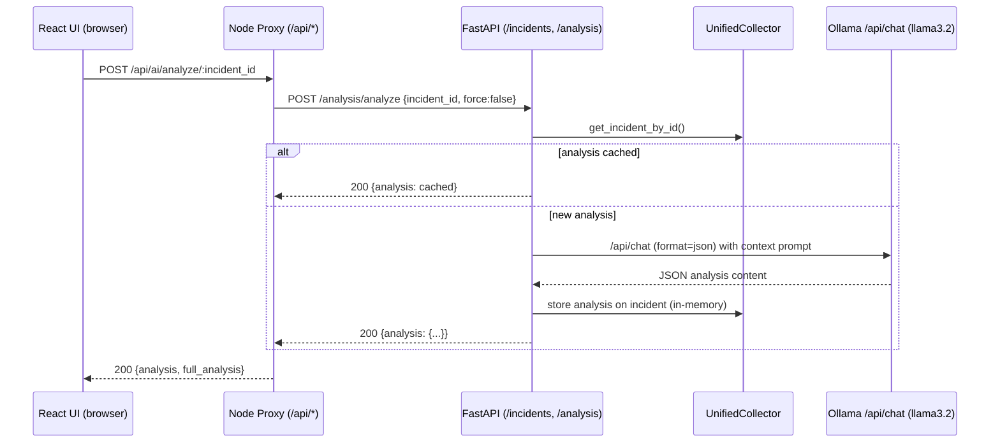

## Project Achievements

Note: This section documents your project's outcomes and current status. Highlight completed milestones and remaining work to provide a clear picture of project progress.

### Achievements

Note: Summarize the main achievements of your project.

- **End-to-end integrated system (real services, no “fake LLM calls”)**: React UI + Node proxy (`frontend/server.ts`) + FastAPI backend (`SovereignAI-Triage/backend/main.py`) + Ollama LLM (`llama3.2`) wired together via `docker-compose.integrated.yml` and `./start-integrated.sh`.
- **Real K8s/OpenShift signal ingestion (with safe fallback)**: `UnifiedCollector` uses in-cluster config or local kubeconfig; when neither exists it enters **demo mode** and still provides incidents for UI/API verification (`SovereignAI-Triage/k8s_collector/collector.py`).
- **Incident → context → analysis loop implemented**:
  - **Detection**: incident types derived from pod/container state (CrashLoopBackOff, ImagePullBackOff, OOMKilled, FailedScheduling, restart storms, etc.) (`SovereignAI-Triage/k8s_collector/incident_detector.py`).
  - **Context capture**: log excerpts, events, resources, node info, related objects; env vars sanitized/redacted (`SovereignAI-Triage/k8s_collector/context_builder.py`).
  - **AI analysis orchestration**: `/analysis/analyze` triggers analysis; results are cached per incident to avoid repeated LLM calls (`SovereignAI-Triage/backend/services/analysis_service.py`).
- **Sovereignty posture documented with evidence**: A “100/100” sovereignty validation is included with explicit claims for data residency, no external API calls, RBAC minimality, and supply-chain transparency (`SovereignAI-Triage/catalogathon/SOVEREIGNTY_VALIDATION.md`).
- **Operational entrypoints + test flows**: One-command start scripts (`./start-local.sh`, `./start-integrated.sh`) plus health/API test commands and incident simulation (`TEST_COMMANDS.md`, `test-incident.sh`, `test-system.sh`).

### Pending Design and Steps

Note: Document anticipated next steps to improve or leverage what was developed.

- **Close remaining “not implemented yet” UX paths**:
  - **Resolve incident**: UI calls `/api/incidents/:id/resolve` but proxy currently returns `501` and backend has no “resolve” endpoint implemented (see `frontend/server.ts` and `SovereignAI-Triage/backend/api/incidents.py`).
  - **Create incident**: UI path exists but proxy returns `501` (same file).
- **Fix observability accuracy**:
  - **Metrics bug with Ollama**: `backend/api/metrics.py` sets `model_loaded` via `llm_service.model`, which does not exist for `OllamaService`; this prevents correct model status metrics under the primary Ollama path.
- **Replace remaining placeholder analytics**:
  - `frontend/server.ts` generates trend line data via random values; convert to real time-bucketed counts from `/incidents` and/or `/metrics`.
- **Unify “catalog-ready single-container” vs “integrated multi-container” packaging**:
  - The repo contains both: catalogathon docs emphasize single-container multi-process (Streamlit + FastAPI + metrics + bundled model), while this workspace also provides an integrated 3-container demo (frontend + backend + Ollama). Align documentation and/or maintain both as explicit deployment modes with crisp invariants.
- **Agentic growth (error-fixing automation)**:
  - Add a lightweight “triage agent” workflow: continuously watch incidents, propose a fix plan, and optionally generate Kubernetes patches/commands for the operator to approve (human-in-the-loop).
  - Add guardrails: schema validation, policy checks (no secrets exfiltration), and provenance capture (every recommendation traces to logs/events/context lines).
- **Scalability roadmap (Langflow / agent frameworks)**:
  - Encapsulate “context → prompt → LLM → validation → storage” as a standalone pipeline step with clear I/O contracts (JSON schemas).
  - Expose this pipeline as a reusable “node” (Langflow) and “tool” (agent runtime), keeping sovereignty constraints as first-class policies.

---

## Architecture Summary

Note: Describe the overall system design and component interactions. Include diagrams showing how services connect and communicate.

### Current method (as implemented in this workspace)

- **Frontend**: React SPA served via a Node/Express server that also acts as a **backend API proxy** (`frontend/server.ts`) on port `3000`.
- **Backend**: FastAPI app on port `8080` providing incident + analysis APIs; starts the `UnifiedCollector` monitoring thread at startup (`SovereignAI-Triage/backend/main.py`).
- **LLM**: Ollama on port `11434` running `llama3.2`; backend calls `/api/chat` with `format: "json"` to force structured output (`SovereignAI-Triage/ai_engine/ollama_service.py`).
- **Cluster**: Kubernetes/OpenShift API is accessed read-only via official clients; collector auto-detects platform and gathers pod logs/events/context.

```mermaid
flowchart LR
  U[User Browser] -->|HTTP :3000| FE[Frontend: Node/Express + React UI]
  FE -->|Proxy HTTP| BE[FastAPI Backend :8080]
  BE -->|read-only API calls| K8S[(Kubernetes / OpenShift API)]
  BE -->|/api/chat format=json| OLL[Ollama :11434\nModel: llama3.2]

  subgraph Backend Internals
    COL[UnifiedCollector\nmonitor loop (30s)] --> DET[IncidentDetector]
    DET --> CTX[ContextBuilder\nlogs/events/resources/env redaction]
    CTX --> INC[In-memory incident store]
    BE --> INC
    BE --> ANA[AnalysisService\ncache per incident]
    ANA --> OLL
    ANA --> INC
  end
```

### Analysis transaction (request-level sequence)



### Deployment modes present in the codebase

```mermaid
flowchart TB
  subgraph ModeA["Mode A: Integrated demo (this workspace)"]
    A1[frontend container\n:3000] --> A2[backend container\n:8080]
    A2 --> A3[ollama container\n:11434]
  end

  subgraph ModeB["Mode B: Catalogathon single-container (docs)"]
    B1[Single container / pod\nsupervisor-managed processes] --> B2[FastAPI :8080]
    B1 --> B3[Streamlit UI :8501]
    B1 --> B4[Metrics :9090]
    B2 --> B5[Bundled local model path\n(legacy) OR external Ollama service]
  end
```

---

## Sovereignty Readiness

Note: Describe what you delivered to improve the sovereignty posture of your solution and what you implemented to get your idea ready for Sovereign Core.

- **No external LLM APIs required**:
  - Primary path is **local Ollama** (`LLM_PROVIDER=ollama`, `OLLAMA_HOST`, `OLLAMA_MODEL=llama3.2`).
  - A legacy local model implementation remains available for strictly air-gapped deployments without an Ollama service (`ai_engine/llm_service.py`).
- **Data minimization + sanitization**:
  - Only “needed context” is collected (recent logs, events, resource limits, related objects).
  - Environment variables are redacted when keys indicate sensitive content (`ContextBuilder` redaction).
- **Least privilege (cluster interaction)**:
  - Collector uses Kubernetes/OpenShift APIs read-only; intended RBAC profiles are included in manifests (see `k8s-deployment.yaml`) and sovereignty validation.
- **Traceable compliance artifacts**:
  - Sovereignty score + checklist + validation approach is explicitly documented (`SovereignAI-Triage/catalogathon/SOVEREIGNTY_VALIDATION.md`).
- **Sovereign Core readiness**:
  - Deployment artifacts exist for Kubernetes (namespace, services, deployments, RBAC) and docker-compose integration; the system can run entirely inside the sovereign boundary.

---

## Visual Summary / Demo Scenario

Note: Provide a swift and short visual tour of your catalogathon execution.

### PNG visuals (generated in this report folder)

- **LLM image 1 (current)**: `llm-01-current-method.png`  
- **LLM image 2 (future)**: `llm-02-scalable-agentic.png`  
- **Backend image 1 (current)**: `backend-01-current-architecture.png`  
- **Backend image 2 (future)**: `backend-02-scaled-architecture.png`

### Demo scenario (60–120 seconds)

1. **Start the system**
   - `./start-integrated.sh` (Docker) or `./start-local.sh` (no Docker).
2. **Show health**
   - Frontend proxy: `GET /api/health`
   - Backend: `GET /health`
   - Ollama: `GET /api/tags`
3. **Create an incident**
   - Run `./test-incident.sh` to create failing pods (ImagePullBackOff / CrashLoopBackOff / OOMKilled).
4. **Observe detection**
   - UI “Active incidents” table updates after the collector check interval.
5. **Trigger AI analysis**
   - Click **AI Analyze** (calls `/analysis/analyze` → Ollama JSON analysis).
6. **Show sovereignty posture**
   - Point to local-only architecture + sanitization + validation doc.

---

## Project Difficulties and Findings

Note: This section captures obstacles encountered and lessons learned. Document both environmental constraints and technical challenges to help future projects avoid similar issues.

### Development Limitations

Note: Document the main roadblocks to your development (hardware, skills, complexity, communications, training, etc.). This feedback is important for tuning future catalogathons.

- **Resource constraints are real for sovereign setups**: local LLM inference and/or Ollama model hosting drives memory/CPU requirements; it heavily shapes the architecture (why JSON-output enforcement + caching matter).
- **Two architecture “targets” increase coordination cost**:
  - Catalogathon docs emphasize single-container “catalog-ready” packaging, while the integrated demo uses multi-container separation (frontend/back/ollama). Both are valid, but require careful docs + test coverage to avoid drift.
- **Cluster access variability**:
  - Some environments have kubeconfig/in-cluster auth; others do not. Demo mode mitigates, but it’s important to clearly label “demo vs live cluster” in UI/metrics.

### Technical Challenges

Note: List the main technical challenges you faced.

- **Structured-output reliability**: enforcing JSON output from the LLM is mandatory for automation credibility; Ollama calls are configured with `format: "json"`, and the backend includes fallback analysis for failures.
- **Context quality vs sovereignty**: capturing enough logs/events to be useful without collecting sensitive content; env var redaction in `ContextBuilder` is a key safeguard.
- **Observability correctness**: metrics currently assume a “local model object exists”; with Ollama, the “model loaded” signal needs a provider-agnostic definition (health + model availability).
- **Frontend credibility pitfalls**: trend charts currently include random values (placeholder), which can undermine trust unless clearly marked or replaced with real computed metrics.

---

## Catalog Post Mortem

Note: Reflect on the overall catalogathon experience. Share feedback on what worked well and what could be improved for future iterations.

Document what you liked and did not like. Provide suggestions for future projects.

- **What worked well**
  - Clear sovereignty constraints forced good engineering discipline: local-first LLM, minimal RBAC, context sanitization, and explicit validation artifacts.
  - The system remains demoable even without a cluster via collector demo mode, reducing demo risk.
  - Forcing structured JSON from the LLM makes the solution “automation-ready” rather than “chatty”.

- **What didn’t work well (or needs tightening)**
  - The codebase currently carries two parallel packaging stories (single-container catalog vs integrated 3-container demo). Without strong contract tests, doc drift is likely.
  - Some API/UI paths are stubbed (`resolve`, `create incident`), which can be visible during demos and reduce perceived completeness.
  - A few dashboard analytics are placeholder-generated, which can be misread as “mocked” unless corrected.

- **Suggestions for future catalogathons**
  - Provide a “golden demo cluster” (or simulator) accessible to all teams to reduce kubeconfig variability.
  - Include a lightweight “sovereignty CI checklist” template (network egress scan, RBAC diff, secrets scan, SBOM presence check).
  - Encourage “structured output” patterns early (JSON schema + validation) so agentic automation remains safe and testable.

